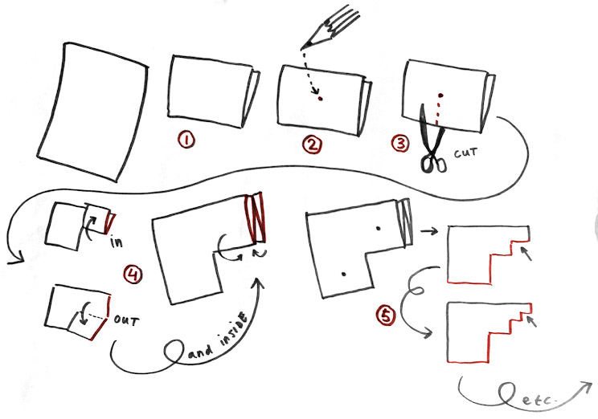
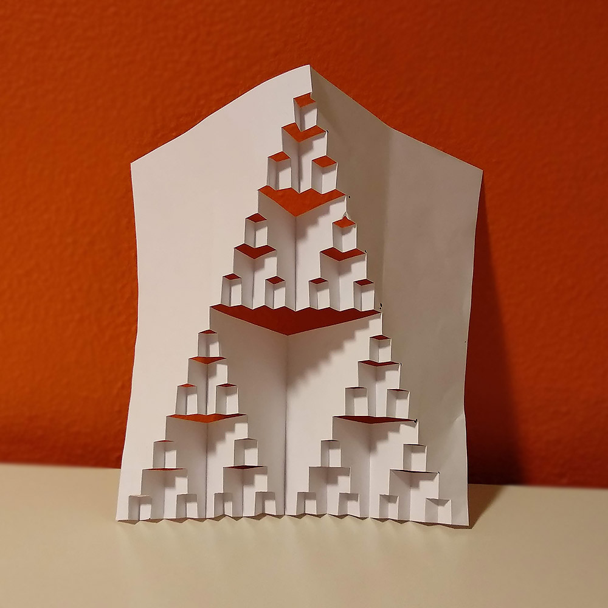
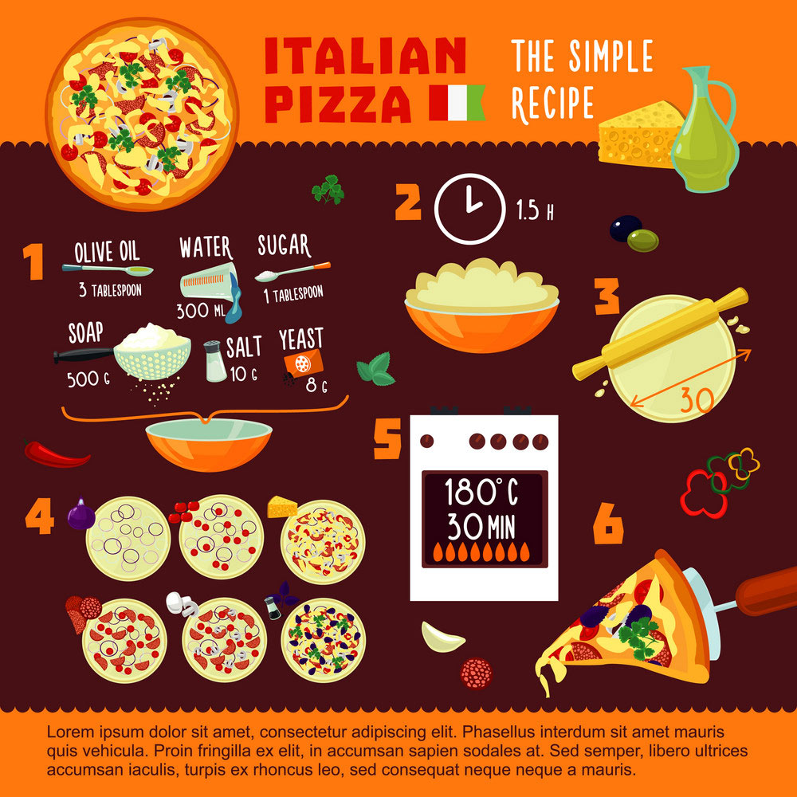
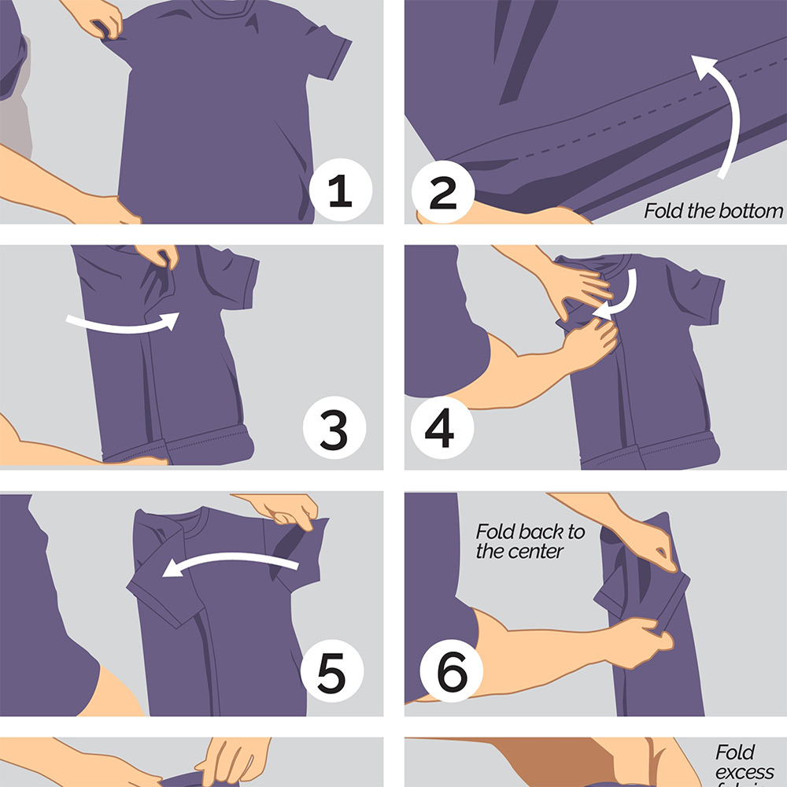
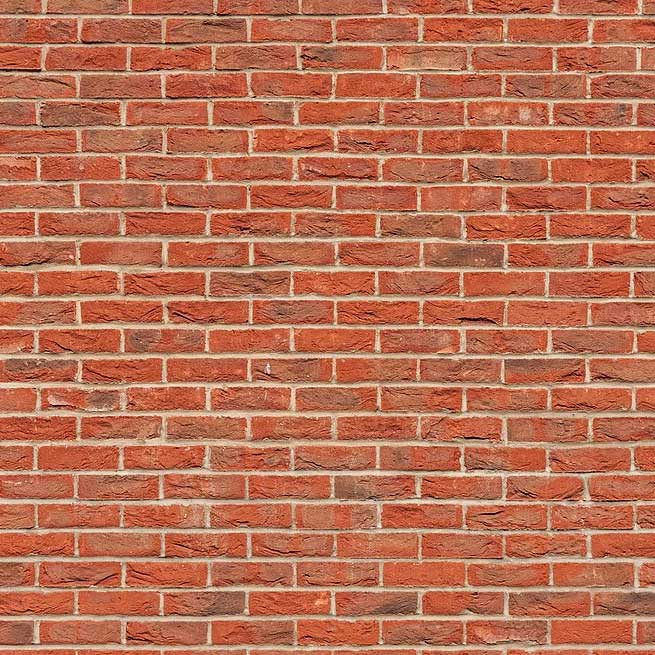
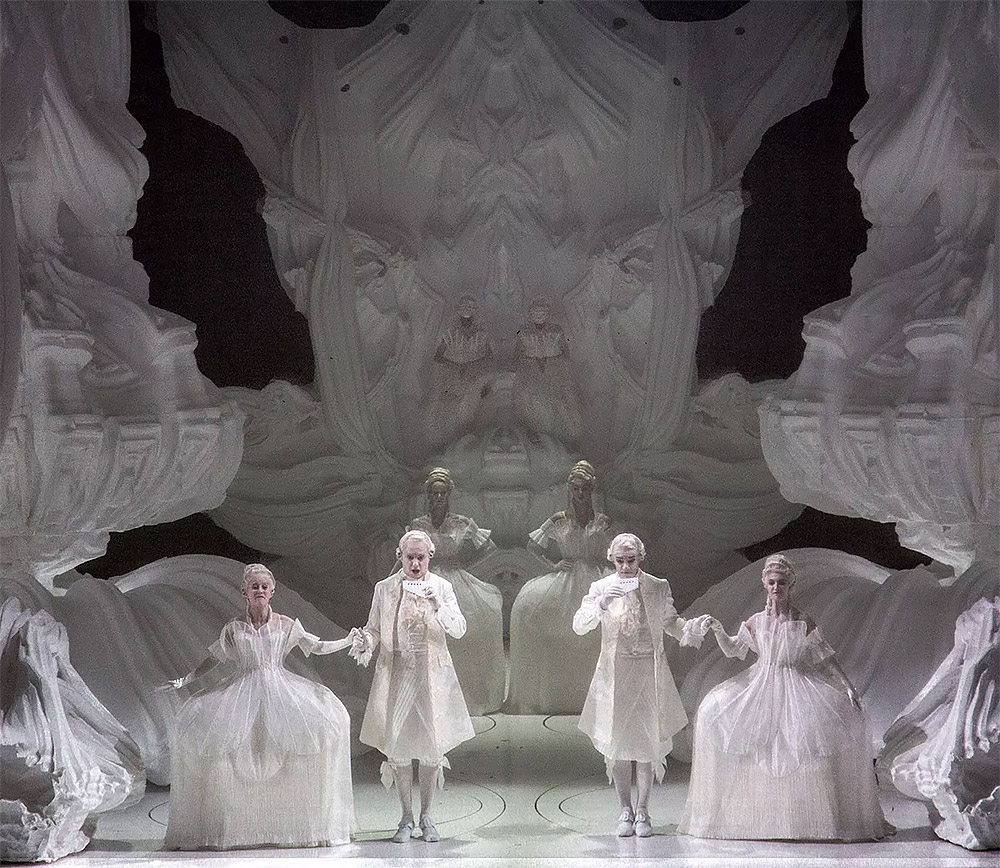
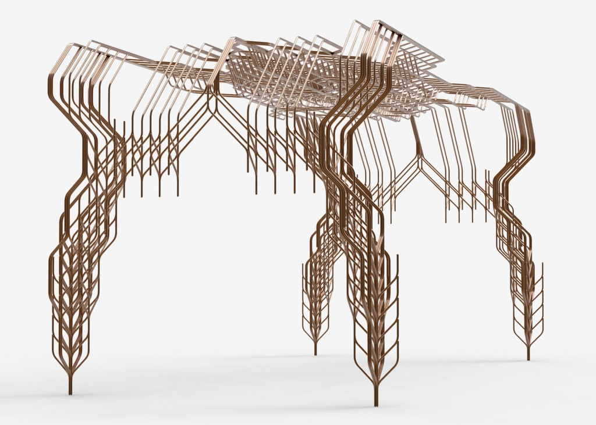
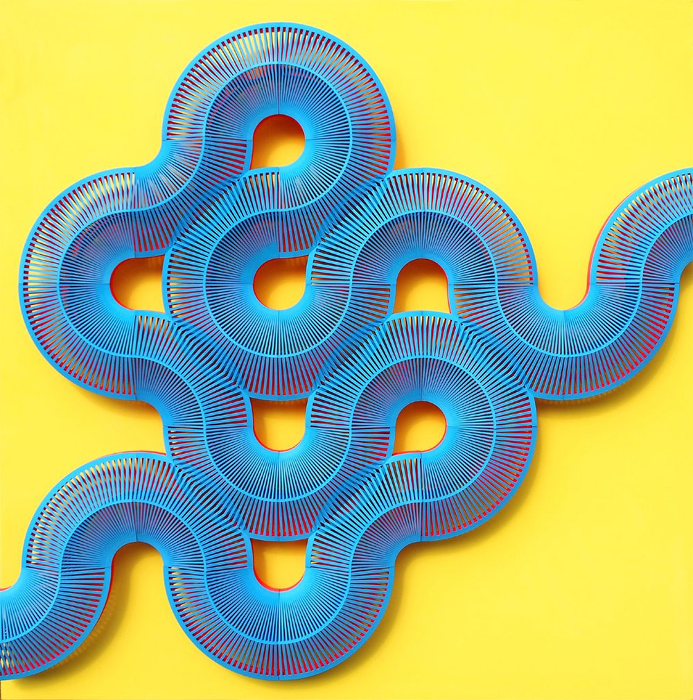
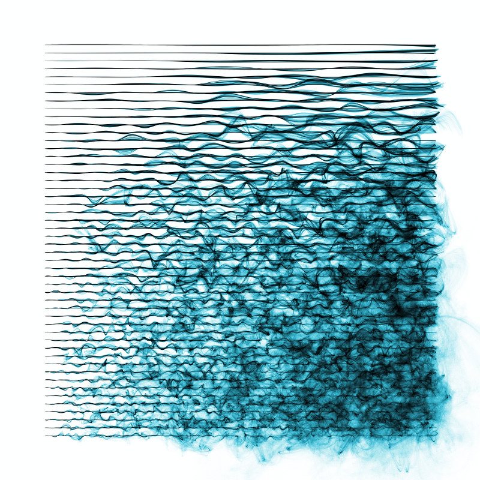
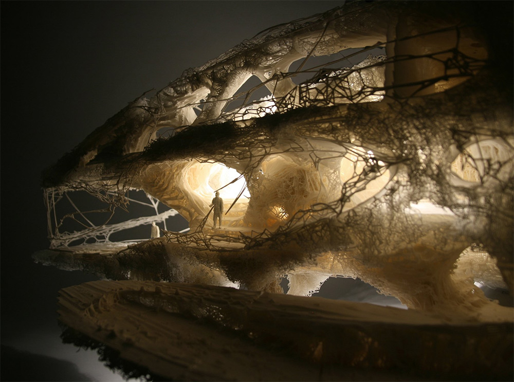

  <h2>
    Become an 
    <big>Algorist!</big>
  </h2>

<code>alt+RIGHT</code> to move forward | <code>alt+LEFT</code> to move back

---

| 1 2 2

## Warming up...

Let's start with a small warming-up exercise.

-

1. Fold a sheet of **A4 paper in half** <small>*(short edge to short edge)*</small>
2. Find the **center** and mark it with a pen <small>*(don't have to be TOO precise)*</small>
3. From the **<u>closed edge</u> cut the paper** to the center point
4. Fold the right ‘flap’ up and down and then fold it inside itself
5. Repeat steps 3 to 5 for each rectangle at the top left

---

| 1 2

## Nice work!

Now if you fold the paper open, you probably end up with something like shown on the picture.

By following these steps of cutting and folding you were following something that is called an **ALGORITHM**.

-

---

  

  so now we know, that...

  # **an Algorithm**
  #### is a __set of steps__ needed for __solving a problem__.
  
  

---

| 1 1 2 2

## Actually, we solve algorithms every day

...probably without even noticing.

These are often called **everyday algorithms**. Let's take a look at some examples.

Maybe the most common example of an everyday algorithm is **cooking**.

-

*You have to follow certain steps (recipe) to make a delicious meal.*

---

## More examples of everyday algorithms

-

#### Folding a t-shirt 

*There are more than one methods to fold a t-shirt. Every method is a "different algorithm" of t-shirt folding.*

-

#### Building a brick wall 

*Building a stable brick wall is based on an algorithm too: you have to put the bricks so that every other row of bricks is shifted by half compared to previous one.*

---

| 1 2 2

The brick wall was quite a simple example of an algorithm. It doesn't require too much of analysis to make one. 

More complex algorithms may require a lot of computing power - so much that normally people can not manage it just by themself.

-

## **Computer generated** algorithms

This is where the computers come to the picture - in the past years a lot of designers, artists and architects have been using computers and complex algorithms to create stunning work.

#### Again, let's take a look at some examples

---

| 1 1 2

-

#### Grotto set design by **Michael Hansmeyer**

Grotto set design for Mozart's opera Zauberflöte, directed by Romoeo Castellucci

---

| 1 1 2

-

#### A table by **Stefan Bassing**

Designer Stefan Bassing has used digital modelling to create a pair of tables, made from repetitive elements to simplify the production process.

---

| 1 1 2

-

#### 'Entangle' Wall Tiles by **Lynne MacLachlan**

'Entangle' is a 3D printed wall tilling system, taking inspiration from mathematical tiling principles and quantum mechanics.

---

| 1 1 2

-

#### 'Sand Spline' - generative art by **Anders Hoff**

The idea is based on the concept of mathematical B-splines. 

---

| 1 1 2

-

#### ProtoHouse by **SoftKill**

Softkill Design has recently completed ProtoHouse, a prototype for the first 3D printed house, that has the same structure than human bones. 

---

These were examples of world famous innovative creators. You may think, that probably they use some billion-dollar supercomputers plus  dark powers to make such stuff. 

Let us demonstrate, that **even quite simple systems can create quite interesting results.**

### But...

---

### ...but first we have to understand the very basics of how computer algorithms work: 

1. **INPUT:** you "feed" some parameters (variables) or data to your algorithm
2. **PROCESSING:** algorithm does the computing
3. **OUTPUT:** you get a result

#### Let's try this with a couple of small interactive simulations on next slides

---

| 1 2 2
| 3 3 3

#### Some lines

-

<small>Just move the sliders and see what happens. Nothing too special here - our algorithm creates a bunch of small lines that change when parameters change. Parameters change when you move the sliders. That's it.</small>
-

<f-slider-data :sliders="[
    { title: 'step', from: 0.1, to: 2, value: 0.7, float: true },
    { title: 'width', from: -1, to: 1, value: 0.02, float: true },
  ]" class="layout-hack">
  <f-scene slot-scope="sdata" width="600" height="500">
    <f-repeat-grid :step="sdata.value[0]">
      <f-group slot-scope="rdata">
          <f-line
            :points="[
              { x: 0, y: 0 },
              { x: sdata.value[1], y: 0 },
            ]" 
            :stroke-width="3" 
          />
      </f-group>
    </f-repeat-grid>
  </f-scene>
</f-slider-data>

---

| 1 2 2
| 3 3 3

#### Let's add rotation

-

<small>Ok, now you have three sliders - we added **rotation**. Play with them and see if you can create any interesting output. </small>

-

<f-slider-data :sliders="[
    { title: 'step', from: 0.1, to: 2, value: 0.5, float: true },
    { title: 'width', from: -3, to: 3, value: 0, float: true },
    { title: 'rotation', from: -180, to: 180, value: 0.1, float: true },
  ]" class="layout-hack">
  <f-scene slot-scope="sdataR" width="600" height="500">
    <f-repeat-grid :step="sdataR.value[0]">
      <f-group slot-scope="rdataR" :rotation="{z: sdataR.value[2] }">
          <f-line
            :points="[
              { x: 0, y: 0 },
              { x: sdataR.value[1], y: 0 },
            ]" 
            :stroke-width="3" 
          />
      </f-group>
    </f-repeat-grid>
  </f-scene>
</f-slider-data>

---

| 1 2 2
| 3 3 3

#### Squares

-

<small>Simple lines can get boring quite fast. Let's explore a few more complex shapes. Now we play with a square. Squares can get pretty cool if you 4add some rotation to them. Try it out!</small>

-

<f-slider-data :sliders="[
    { title: 'step', from: 0.1, to: 2, value: 0.5, float: true },
    { title: 'size', from: -3, to: 3, value: 1, float: true },
    { title: 'rotation', from: -180, to: 180, value:0, float: true },
  ]" class="layout-hack">
  <f-scene slot-scope="sdataB" width="600" height="500">
    <f-repeat-grid :step="sdataB.value[0]">
      <f-group slot-scope="rdataB" :rotation="{z: sdataB.value[2] }">
          <f-box
            :stroke-width="1" 
            :width = "sdataB.value[1]"
            :height = "sdataB.value[1]"
          />
      </f-group>
    </f-repeat-grid>
  </f-scene>
</f-slider-data>

---

| 1 2 2
| 3 3 3

#### Circles

-

<small>Circles are just CRAZY! Remember - all we are doing here is to repeat one simple circle and adjusting its radius, but the visual output can get very complex and interenting.</small>

-

<f-slider-data :sliders="[
    { title: 'step', from: 0.1, to: 2, value: 1, float: true },
    { title: 'radius', from: 0, to: 3, value: 0.5, float: true },
  ]" class="layout-hack">
  <f-scene slot-scope="sdataC" width="600" height="500">
    <f-repeat-grid :step="sdataC.value[0]">
      <f-group slot-scope="rdataC">
          <f-circle
            :stroke-width="1" 
            :r = "sdataC.value[1]"
          />
      </f-group>
    </f-repeat-grid>
  </f-scene>
</f-slider-data>

<!-- ---

#### A polygon

<f-slider-data :sliders="[
    { title: 'step', from: 0.1, to: 2, value: 0.5, float: true },
    { title: 'rotation', from: -180, to: 180, value: 0, float: true },
    { title: 'radius', from: 0, to: 3, value: 1, float: true },
    { title: 'sides', from: 3, to: 8, value: 3, float: false },
    
  ]">
  <f-scene slot-scope="sdata" width="1000" height="500">
    <f-repeat-grid :step="sdata.value[0]">
      <f-group slot-scope="rdata">
          <f-regularpolygon
            :rotation="{ z: sdata.value[1] }"
            :count="sdata.value[3]"
            :stroke-width="1" 
            :r = "sdata.value[2]"
          />
      </f-group>
    </f-repeat-grid>
  </f-scene>
</f-slider-data>

 -->

---

| 1 2 2
| 3 3 3

#### Random

-

<small>One more fun thing to try - now we added some **randomness** to circle radius parameter. Now, whichever parameters changes, all the circles get new unequal radius. This slide is an exact copy of previous one, only randomness is added, but we get completely new output.</small>

-

<f-slider-data :sliders="[
    { title: 'step', from: 0.1, to: 2, value: 1, float: true },
    { title: 'radius', from: 0, to: 3, value: 0.5, float: true },
  ]" class="layout-hack">
  <f-scene slot-scope="sdataC" width="600" height="500">
    <f-repeat-grid :step="sdataC.value[0]">
      <f-group slot-scope="rdataC">
          <f-circle
            :stroke-width="1" 
            :r = "random(0, sdataC.value[1], true)"
          />
      </f-group>
    </f-repeat-grid>
  </f-scene>
</f-slider-data>

<!-- 

<f-slider-data :sliders="[
    { title: 'step', from: 0.1, to: 2, value: 0.5, float: true },
    { title: 'width', from: -3, to: 3, value: 0, float: true },
    { title: 'rotation', from: -180, to: 180, value: 0, float: true },
  ]" class="layout-hack">
  <f-scene slot-scope="sdataX" width="600" height="500">
    <f-repeat-grid :step="sdataX.value[0]">
      <f-group slot-scope="rdataX" :rotation="{z: random(0, sdataX.value[2], true) }">
          <f-line
            :points="[
              { x: 0, y: 0 },
              { x: sdataX.value[1], y: 0 },
            ]" 
            :stroke-width="3" 
          />
      </f-group>
    </f-repeat-grid>
  </f-scene>
</f-slider-data>

 -->

---

These were some very simple examples of what a basic repeating combined with some scaling and/or rotating can generate from black and white geometric objects. 

This is just a beginning, we didn't even touch other important properties like color, stroke width, transparency and so on. 

---

Take a piece of a folded paper and the scissors. Now, your task is to create a 5 step algorithm using the tools that you were provided with.

---

